# Cybrid

**Cybrid** is an open-source MIDI controller.

## Introduction

**Cybrid** is a DIY project I finished in 2020. The main goal was to turn a grand piano action into a MIDI controller.
In digital piano terminiology instruments with a real wooden piano action are called _hybrid_ pianos. I own
one such instrument, the Yamaha AvantGrand N1X which is a digital piano with real grand piano action and realistic
piano hammers that are stopped by a cushioning rail instead of strings.
There are optical sensors that detect the hammer velocity and produce digital piano sound.
In other words, it's a hybrid between an acoustic piano and a digital piano. I really like the Yamaha AvantGrand concept
and wondered if I can re-create something similar as a DIY project. Since I participate on various Internet piano forums
with the CyberGene nickname, another user suggested that I name the project Cybrid (from **Cyber**Gene and **hybrid**).

I am a Java engineer and had no prior experience with programmable boards, low-level programming, electronics, DIY,
woodowrking, metal working, piano regulation, etc. which is why it took me quite some time to learn the basics of all these
things and combine them to produce the final project. It is also why some decisions I made are rather clumsy
and the final result is not very polished. I'm glad this project served as an inspiration to other similar projects though.
Soome of them are better designed and are also more easily reproducible.

Here's a demo of the finished Cybrid controller (click on the picture to open the YouTube video in a new tab):

This GitHub project contains just the PCB design, the software and the mechanical
considerations/descriptions of the controller. It may be used "as is" for anyone willing to recreate that project, or
can evolve into a more advanced and improved design that can be used as a basis, or inspiration for other (hybrid or regular) MIDI-controllers,
etc.

If you would like to discuss this project, there's a discussion thread on
the [PianoClack Forum](https://pianoclack.com/forum/d/107-cybrid-a-diy-midi-controller-with-grand-piano-action)

## Brief description

### Main Principle

The goal of the project is to detect the velocity of the piano hammers and trasnalate it into MIDI velocity. This is realized by
using
[Vishay CNY70](https://datasheet.octopart.com/CNY70-Vishay-datasheet-5434663.pdf)
optical sensors and
[Texas Instruments LM339](https://www.ti.com/lit/ds/symlink/lm2901.pdf)
voltage comparators (LM339AD package).

**The main principle of using voltage comparators to turn continuous analog signals into digital binary signals has been
suggested by Marcos Daniel, a member of the PianoWorld forums. Everything else, including the multiplexing, PCB design,
Teensy code and integration with a real grand piano action has been done by me.**

* The CNY70 is an optical proximity sensor that consists of a photoemitter (a LED) and a phototransistor. The
  phototransistor will change its collector current depending on the proximity of subjects to the sensor
* By measuring the voltage drop created by the collector current on a resistor and comparing it to a reference voltage,
  we will know whether the subject is within a predefined proximity.
* A voltage comparator is a device that has two voltage inputs and a digital output. One of the inputs is a reference
  voltage selected through a trimpot and the other input is the phototransistor output voltage. If the phototransistor
  output voltage is higher than the reference voltage, the output of the comprator will be digital 1, otherwise it will
  be digital 0.
* Thus we can turn the continuous analog sensor signal into a discrete digital binary value that changes when
  the subject crosses a predefined distance

That is important because the LM339 voltage comparator is very fast when comparing two voltages. It takes just a few
nanoseconds to switch its digital state. That allows for a very fast distance detection, or more specifically whether
the hammer is either closer than, or farther than the preset distance point. In other words, the comparator will provide a digital output
of 1 whenever the hammer crosses that distance and stays closer to the sensor, and will switch back to zero when the
hammer crosses that point on its way back and moves away from it. By using that principle, we can avoid slow
analog-to-digital conversion. (As you will see in the following paragraphs, if we scan through all 88 keys of a piano,
and rely on just ADC to read the exact position of each hammer, might be a tricky task for many reasons.
First, because most programmable controllers such as Arduino/Teensy, etc. have only a few (1 or 2) ADC chips and a single
conversion takes microseconds which would cumulatively lead to inability to scan the entire keyboard without introducing
huge latency and without missing the very fast hammer motion. And second, even if fast ADC-s are used, it will require that we
multiplex analog signals and that's not a trivial task since there will be noise, etc.)

So, we can configure two preset distance points through two trimpots and use two voltage comprators. We will have two digital
outputs from the two comparators and by measuring the time it takes for the hammer to pass between the two points (i.e.
the comprators' outputs switch from 0 to 1), we can calculate velocity.

### Additional details

#### Multiplexing

A standard way of reading multiple sensors through limited number of inputs is through multiplexing, i.e. using
specialized chips that can
(roughly speaking) switch between multiple inputs and then channel them through a single line. However a particular problem
with this approach is that there is a switch delay and in this particular implementation scanning speed is of highest
importance. To work around that, we can use a programmable controller with as many inputs as possible, and one such board is the
[Teensy USB Development Board](https://www.pjrc.com/teensy/). It has 58 digital input/output lines.

#### Grouping

We can gather multiple scanned notes into a group, then select a group, read all the sensor data (each sensor outputting
two digital signals corresonding to two distances, as seen above), then switch to the nextg group, etc. until we read
all notes. In the current implementation, for a 88-key piano, we have 3 binary signals per note (see below why 3 and not
just 2) and a group is made of 5 notes. This means we have 18 groups
(the last group only contains 3 notes and not 5):

**18 groups x 5 notes** = 90 notes (-2 unusued in the last group) = 88 notes

**3 signals per note** = 15 signals per group

**18 groups x 15 signals** = 270 binary signal lines

Now, if we can enable only one group at a time, we can then read the 15 signals from each group by reusing one and same
15 input signal lines. Thus we will have 18 *group enable* lines from the Teensy (outputs) and 15 input lines shared by
all the 18 groups.

**18 outputs + 15 inputs = 33 digital input/outputs.**

Seems like we can go without using a mux/demux chips. Instead we will share inputs between groups. However, the problem
is if we just wire the corresponding inputs of the groups, and since they will continuously generate differing signals (
one group can generate high signal at the same time another group will generate low signal), it means they will be
short-circuiting themselves. To avoid that, we will use digital transceiver chips. A transceiver is a simple device that
has a certain number of digital inputs and digital outputs. It will repeat on the outputs the same digital signal that
it has on the corresponding input. Each transceiver chip also has an enable/disable line. When in disabled state, the
outputs will be in high impedance state (regardless of input signals), 
and that is how we solve the problem of short-circuiting. For the current solution we use
[SN74LVC245A](https://www.ti.com/lit/ds/symlink/sn74lvc245a.pdf) Octal Bus Transceivers With 3-State Outputs (
SN74LVC245ADWR package).

#### Circuit boards, wiring, power

There are three types of printed circuit boards

* **Sensor PCB** - these are very small PCB-s each containing a single CNY70 sensor and placed above each hammer shank base.
  In a 88-key piano there will be 88 of these. 5 of these connect to a single Note PCB.
* **Note PCB** - these are the group modules. Each one serves 5 Sensor PCB-s. Each Sensor PCB is connected through three
  wires (5V, signal, GND). There are three trimpots per sensor PCB, for setting the predetermined detection distances.
  The uppermost trimpot is for sensor 1 which is the closest distance to the hammer stop rail. The Note PCB-s also
  contain a jumper that is set to one of 18 positions to determine the group number of the Note PCB. Note PCB-s also
  have an IDC34 socket. The Note PCB-s should be aligned on a horizontal line and be connected through a single IDC34
  cable that has 18 IDC connectors. Each Note PCB has two power sockets. Each power socket has three lines (5V, 3.3V,
  GND). The two power sockets are wired to each other so that one can be used as power input and the other as power
  output for chaining to the next Note PCB. There are two voltages because the CNY70 sensors and the comparators are
  powered by 5V, however the digital signals from the transceivers as well as their power supply is 3.3V. The Teensy 3.6
  controller supports only 3.3V voltage (unlike Teensy 3.5 and older but they are slower)
* **Teensy PCB** - this one contains the Teensy controller, an IDC34 socket for controlling the Note PCB-s, power
  inputs/outputs to chain to the Note PCB-s, and possibility to connect other devices (e.g. a sustain half-pedal to the
  analog inputs.) It has s USB-B input that's used only for power input. The Teensy controller itself has a micro-USB
  for connection to the computer to transmit MIDI. The Teensy controller itself is powered through that USB connection.
  Everything else requires an external power, for instance using the USB-B input socket. In the current implementation
  an iPad charger is used and it's sufficient to provide 2W of power which is the entire consumption. On the Teensy PCB
  there's also a jumper that can draw 3.3V power from the Teensy controller and send it to the Note PCB-s, however
  that's not recommended since there might be short circuits or problems with the Note PCB-s that can burn the Teensy.
  In the current implementation a pretty simple 3.3V voltage regulator is added through a small customized breadboard
  attached to the Teensy PCB, drawing from the 5V power.

The PCB-s are designed in the free KiCad editor.

**To Be Done** (a BOM or list with exact elements)

#### Scanning algorithm

The program is written in the Arduino compatible language of Teensyduino. It would sequentially enable each Note
module (a note module is serving 5 notes x 3 inputs). For each module all the 15 inputs are read. For each optical
sensor there are three predefined sensor distances (set through trimpots and with the calibration utility programs) that
are referred to in the code as sensor1, sensor2, sensor3. Sensor3 corresponds to the damper being removed from the
string, it is halfway from the hammer travel. Sensor 2 is where escapement happens. Sensor1 is where the hammer touches
the rail (in reality it should be a bit further to allow for the scanning logic to catch that moment because the hammer
will rebound quickly and sensor1 will be activated for only a brief moment).

***Active low* logic is used.**

Sensor distance signal lines stay active as long as the hammer is at this distance or closer to the rail. This means
when sensor1 is active (low), sensor2 and sensor3 are also active, etc.

When the hammer activates sensor2 for the first time, it means we
"start" measuring duration and we remember the timestamp of that event.

When the hammer activates sensor1 for the first time, it means we have a
"hit" and so we produce a MIDI note-on event based on the duration. A velocity is obtained through an in-memory map that
holds logarithmic velocity values that have been pre-calculated.

On its way back, if the key is held, the hammer will stay within sensor3 activation region and so the sound will
sustain. Once the key is released, the hammmer will deactivate sensor3 (high signal) and that's when MIDI note-off is
sent.

**These timestamp recordings and events are recorded sequentially
(group by group, input line by input line), because we want to give equal chance for each event to be recorded as soon
as it happens. For instance, once we read the event "hammer passed through C4 middle sensor" we will continue scanning
other keys and sensors and we will be able to check that hammer then passed through C4 sensor 1 (i.e. a hit)
only on the next full loop. Therefore it's of the highest importance that there's no delay in any scanning speed. The
fastest the entire loop finishes, the more precise the velocity calculation will be.**

TBD (velocity map calculation) for quick calculation a velocity map is pre-calculated on program startup and held in
memory to allow for a quick "
duration -> MIDI velocity" value to be read from memory rather than being calculated all the time (since it also
includes logarithms, etc. which is slow.)

TBD (group velocity offset calculation) the high keys hammers are lighter than the low ones. If we don't account for
that, the produced MIDI velocity value is too high and the key sounds too loud. Therefore an offset needs to be applied
and pre-calculated, so the velocity map is actually further split into groups (
corresponding to the note PCB groups.)

TBD (half-pedal mapping) uses the ADC module.

#### Calibration

_(Copy-paste from a forum discussion)_

If you mean the Calibrate_Sensor_1/2/3 programs in the utils folder, those are actually temporary programs meant to assist in calibrating the sensors. Let me do some explanations first:

Not sure why I used the confusing word "sensor" but I actually meant sensor "point". Each optical sensor is used to detect three predefined distances of each hammer:

- Point 3: Hammer at half the distance between rest point and stop rail. When the hammer is above that point, I consider this as the damper being lifted, so once I detect a hit and send a Note ON event, then I will wait for the hammer to drop below this point and is when I will send Note OFF.
- Point 2: Hammer at 1mm from the stop rail (this is where hammer is released from the jack, i.e. the escapement), we start measuring duration from this point
- Point 1: Hammer at (or very close to) the stop-rail, this is where we stop measuring duration and derive velocity from it

Now, through the trimpots you set where those three distances for each sensor (hence hammer) are. In order to quickly do that, I created the three helper programs for each sensor point.

Here's the procedure:
- Upload the corresponding program for the corresponding "sensor" point (1, 2, 3).
- The program is a very simple logic that detects if any sensor (for any hammer) is at a distance equal or closer to the corresponding point and if true, will lit the Teensy LED

To facilitate the initial rough calibration I use:

- A simple wooden block that has such dimensions that when I put it at the stop-rail and lift the hammer, so that the hammer touches the block, then hammer is at exactly half the blow-distance (point 3).

- I use a thin plastic strip with 1mm thickness for point 2.

- For point 1 I just lift the hammer until it touches the stop-rail.

- So, depending on which of these three utility programs are loaded, I use the corresponding wooden block, or strip, or the stop rail itself, and I lift each hammer one by one until it touches the wooden block, the strip or the stop-rail. And I observe the LED and turn the corresponding trimpot until the LED is lit.

Once I am ready, I then upload the main program loop and surprisingly the above calibration is already pretty close to the final result and the piano is pretty playable at this point. It takes less than 10 minutes to do the above and I doubt you have to do it often once performed for the very first time.

I then perform a finer manual adjustment without any tools, only playing the keys one by one and I devised the following procedure:
- I play staccato notes with a high velocity and adjust the first position so that the corresponding key stops being detected. That means that I set the point way too high and the hammer cannot reach it because it's stopped by the rail before it. Then I begin to slowly back off until the hammer "appears" again. If you stop at that point, you will notice that very low velocity might still be missed because the stop-rail cushioning is not compressed enough to trigger it. Or, very high velocity strikes get missed because they are so quick, and the point is set so high, that the scanning doesn't have enough time to detect the hammer while at the point 1. That's why we need to give it some leeway and back off enough the trimpot, so that the hammer is always detected in the peak point, regardless of velocity. Once there, we have the top point set at a good enough distance
- We then proceed to fine-setting the second point. Because adjusting the first point effectively changes the distance between it and the second point, it effectively changes the loudness of that hammer. So, I proceed fine-tuning the second point by ear, choosing a realistic velocity response of the key. This might sound like a very demanding task but surprisingly for me, it is a satisfying thing to do, since I felt like a real piano master who fine-tunes his piano. And actually it's very easy to feel where the good position is.
- I will optionally fine-tune the third point to be where I need the note OFF to happen. My experience is it's not very important.

People often comment on how the above procedure is the main reason they didn't like that solution and how tedious it is, but in fact it's a pretty quick procedure that takes no more than 20-30 minutes in total and is required only the very first time. From there on, only an occasional touch-up is needed. 

### Mechanical Piano Considerations

TBD

### Known Problems

TBD

* stable power with low-ripple is very important. Currently the power comes from a USB-B socket and is chained through
  wires from the Teensy PCB to all the Note PCB-s. This is not a good solution and needs improvement.

### TBD (more details coming...)

### Misc Info

**Because I've been communicating with some people and got some questions, I will paste here raw excerpts from emails if
it can help.**

All SMD elements are of 0603 size/footprint which according to my research at the time was the smallest possible size
that's still possible to be hand soldered. It's pretty tiny as it turned out, so I used one of those specialty glasses (
for jewelry, etc.) that you put on your head with changeable magnification glasses.

There are three resistor values that have been used:

240 Ohm one on each sensor boards: https://store.comet.bg/en/Catalogue/Product/9812/

4.7 kOhm (5 on each module board R18, R28, R38, R48, R58, these are the resistors that are on top of the module board
above the trimpots): https://store.comet.bg/en/Catalogue/Product/9910/

10 kOhm - all other resistors: https://store.comet.bg/en/Catalogue/Product/35586/

On the Teensy board I haven't soldered any resistors. My idea was to limit current draw for powering sustain pedals, so
there's place for resistors but that needs to be calculated ad hoc. I was in a hurry, so haven't limited the Kawai pedal
but there seems to be no problems.

All capacitors are 100 nF (there are 6 capacitors on each module board **on the back side**, they are the only elements
to be soldered on the back side besides the sockets that connect the sensor
boards): https://store.comet.bg/en/Catalogue/Product/50624/

The trimpots are 10k, however due to insufficient quantity I also purchased 20k, I think it makes no difference:
https://store.comet.bg/Catalogue/Product/5925/
https://store.comet.bg/en/Catalogue/Product/6318/

The comparators are LM339AD and are through the Farnell
catalog: https://store.comet.bg/en/CatalogueFarnell/Product/1895017/

The transceivers are SN74LVC245ADWR, however they seem to not be available anymore. I see a similar
part (https://store.comet.bg/CatalogueFarnell/Product/506771/) which is however TSSOP-20 and I'm not sure if its
footprint is the same as SOIC-20 as the original part. Needs to be checked. (P.S. Seems like half the size, so not
compatible)

P.P.S. The transceivers are available at
Mouser: https://eu.mouser.com/productdetail/texas-instruments/sn74lvc245adwr?qs=WzgTT80quPGdOFCXqni3uA==

Here are some of the other parts I ordered:
https://store.comet.bg/en/Catalogue/Product/5003090/
https://store.comet.bg/en/CatalogueFarnell/Product/291323/
https://store.comet.bg/en/Catalogue/Product/286934/
https://store.comet.bg/en/Catalogue/Product/10079/#e30%3D
https://store.comet.bg/en/Catalogue/Product/10151/
https://store.comet.bg/en/Catalogue/Product/10151/
https://store.comet.bg/en/Catalogue/Product/2944/#e30%3D
https://store.comet.bg/en/Catalogue/Product/3116/#e30%3D
https://store.comet.bg/en/Catalogue/Product/17820/#e30%3D (soldered on the backside of the module board, facing the
sensor boards, so that short 10cm three-wire female-female dupont cables I ordered through some Chinese eBay seller can
be used to connect each sensor board to the module boards, I don't have the link for the cables anymore)
https://store.comet.bg/en/Catalogue/Product/20826/ (I cut those into smaller 3-pin pieces which was PITA, these are the
corresponding connectors on the sensor boards to the above part. Before attaching these two parts you need to really
check what the mechanical placement will be of your sensor boards and module boards on your piano and from there to
decide whether you need angled or straight sockets, etc. their orientation, whether you mount them on the backside of
the sensor board or probably an angled one on the front or back, etc. it's flexible and depends on your construction and
ability to connect in either straight line or probably a n arced cable... I thought a lot on that and ultimately decided
on my current variant visible also in the pictures)
https://store.comet.bg/en/Catalogue/Product/48762/ - used to daisy-chain power from a module board to module board, two
of these per module board

Regarding the CNY70 sensor, it's soldered so that the writings/label on the sensor-cube (there is some text only on one
of its sides) is next to the label "
CNY70" on the sensor board. The chips are soldered so that the notch (small marking/hole) matches a corresponding small
circle printed on the PCB.

To daisy-chain the power between module boards I used single-core hard cables that I bought from a hobby-shop, those
cables are used for breadboards.

On the Teensy board there's the possiblity to connect a jumper that will get the 3.3V from the Teensy but I wouldn't
recommend it and I don't use it. Intead I used an improvised 3.3V regulator that is getting 5V from the main USB-power
line (the iPad charger), look at the pictures, a bit awkward but works. I don't remember the regulator part, I bought by
asking on the store but there's some writing on it and I can shoot it. But I guess every regulator will work since the
3.3V consumption isn't high.

On each module board you need to use a jumper to denote the module board index by which it will be read by the software.
On the left side of the IDC connector top to bottom are 1-9, and on the right side top to bottom are 10-18, you start
with 1 at the lowest part of the keyboard.

Making the IDC cable is major PITA. I created my own clamping contraption, you can see it on the pictures. Make this
your last step because the sensor boards are not equally spaced because due to the action brackets the hammers are
grouped and so some module boards will not be centered behind adjacent 5 sensors but would be behind 5 sensors with a
bracket in between. So once you mount the module boards, then you design the IDC cable. And mine was made intentionally
wavy because I already wasted one trying to make it straight but that's a difficult task.

Also, seems like a I screwed up the Teensy IDC orientation and so to make the IDC cable finally connect at the Teensy
without twisting it, the Teensy board needs to be upside-down

For the sustain pedal, I power it from the Teensy PCB and it's connected to A21 on that board, however they swapped it
between Teensy 3.6 and 4.1, so on the 4.1 that's not A21 but luckily it's still an analog input with another name, can't
remember, maybe A20 (see in the code I have a comment for whether you use 3.6 or 4.1).

### Pictures

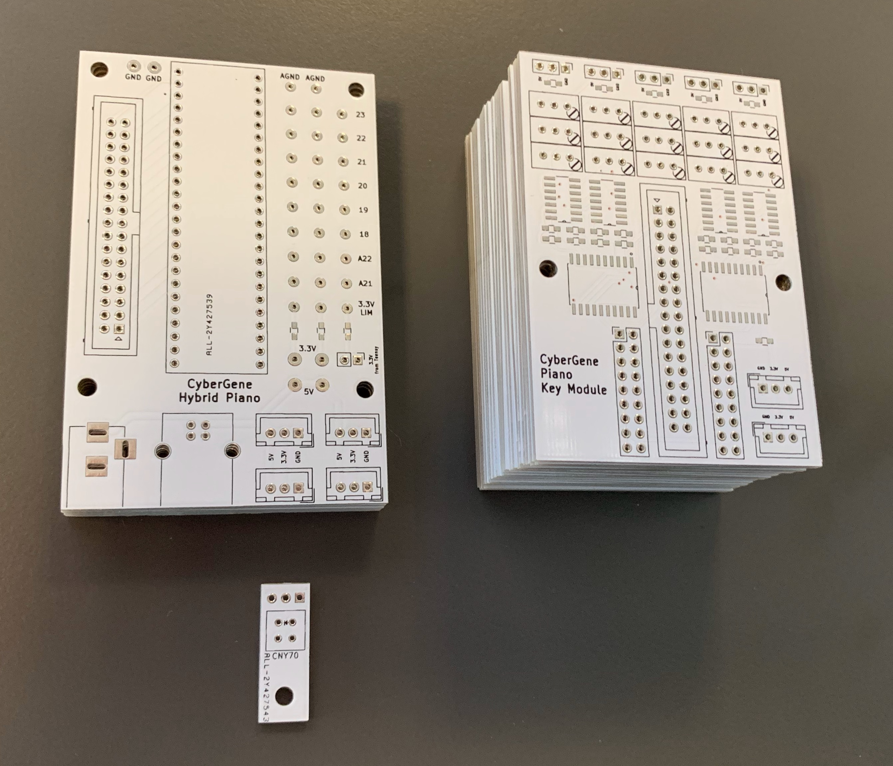

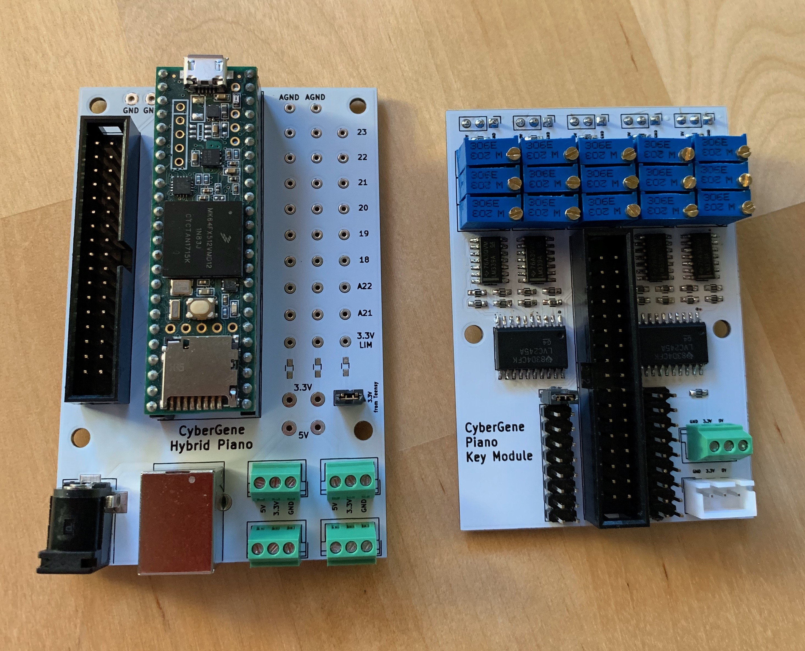

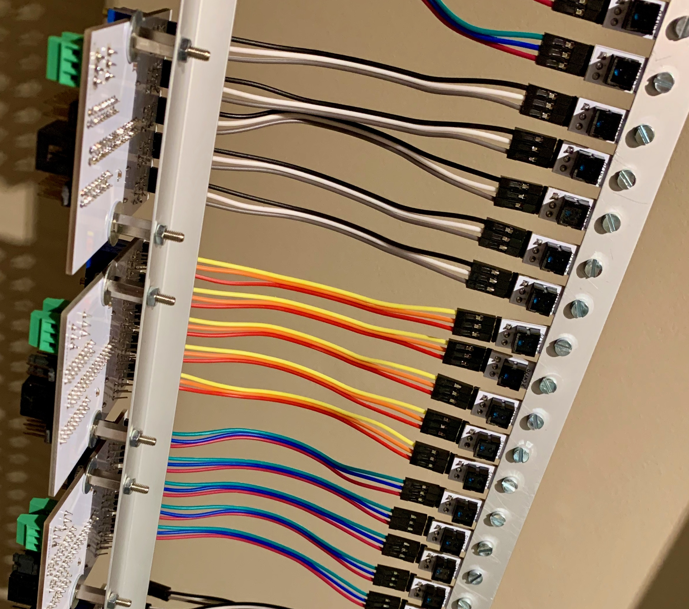

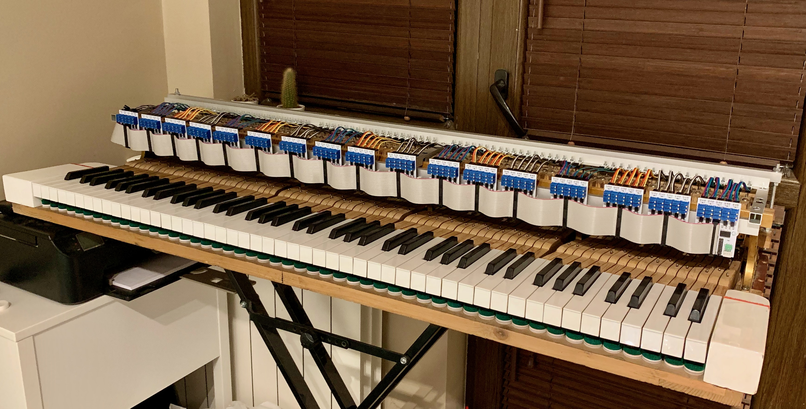

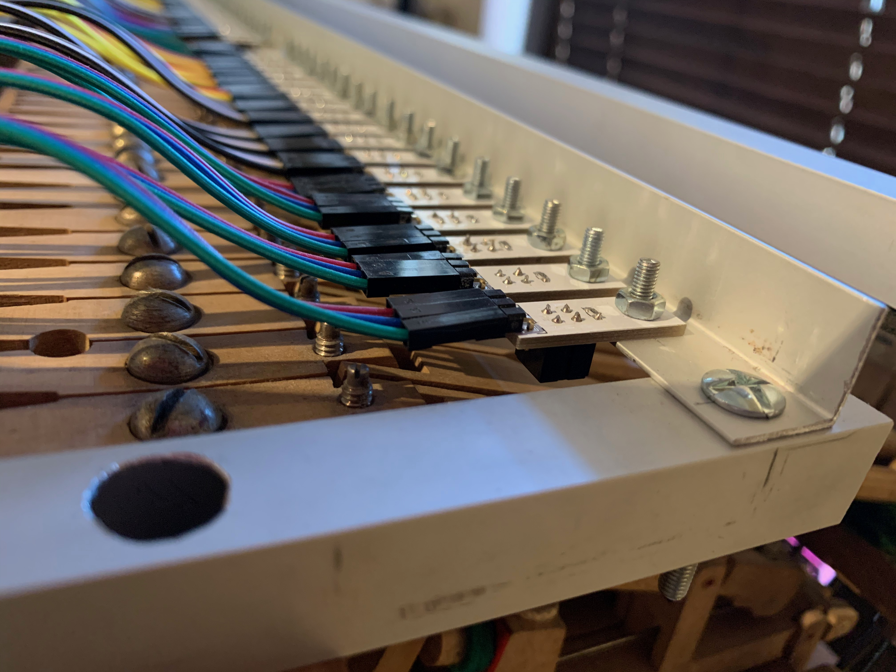

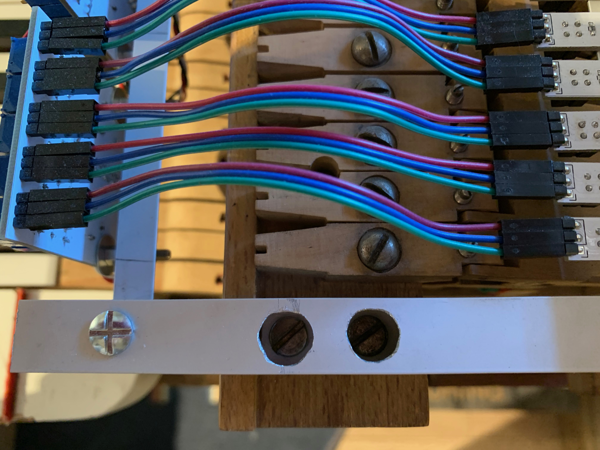

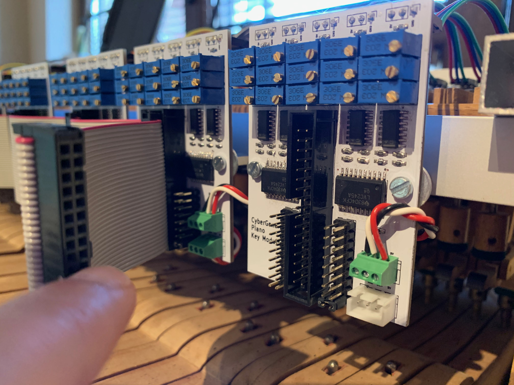

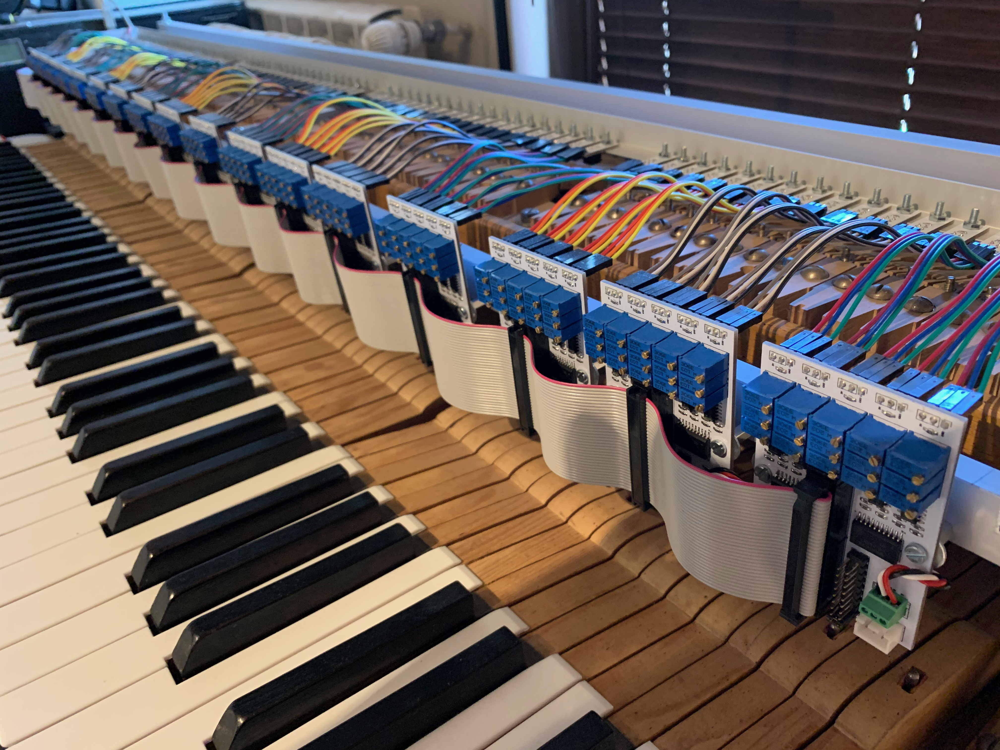

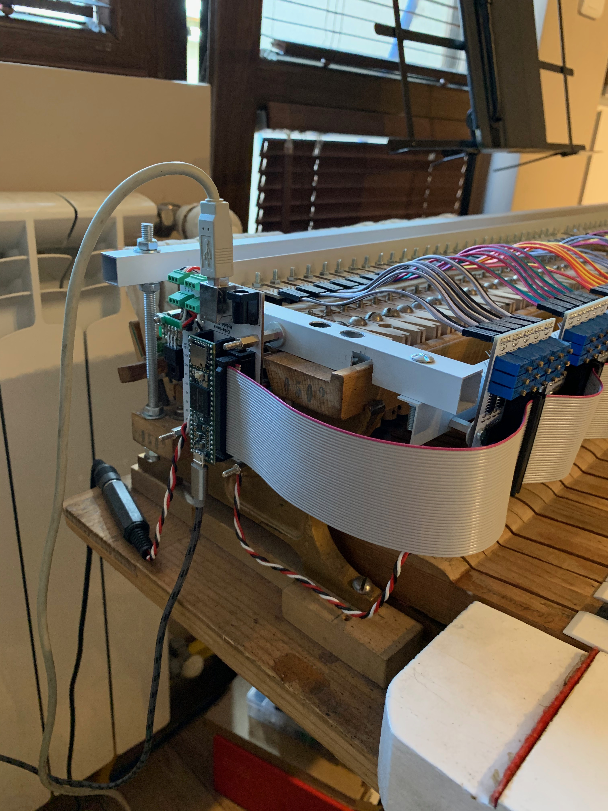

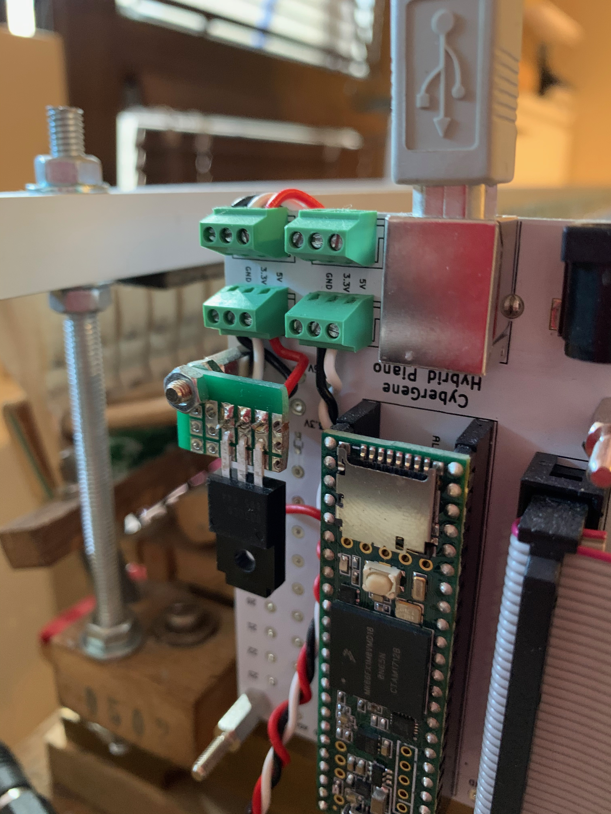

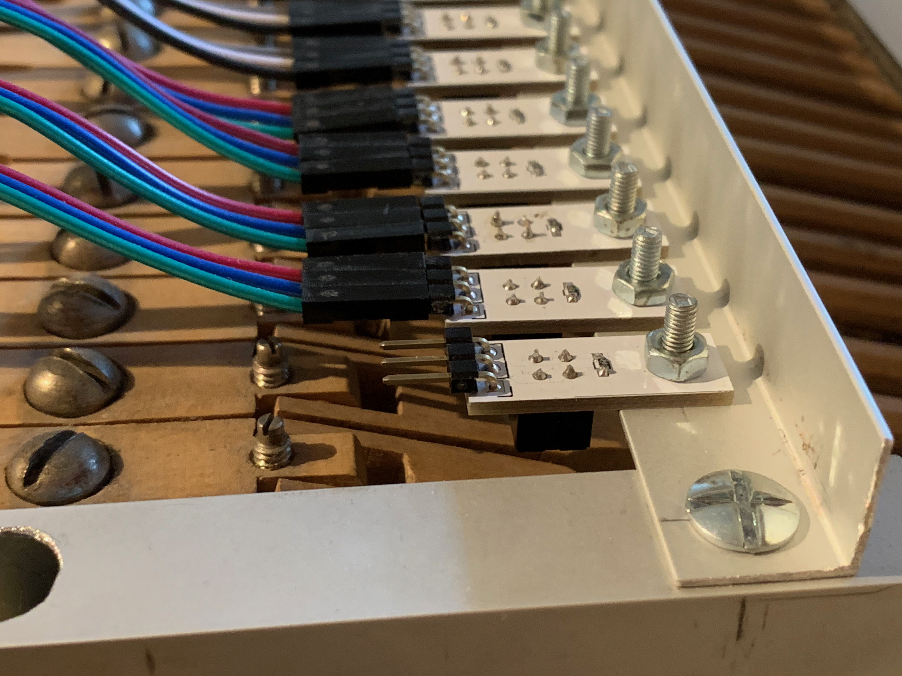

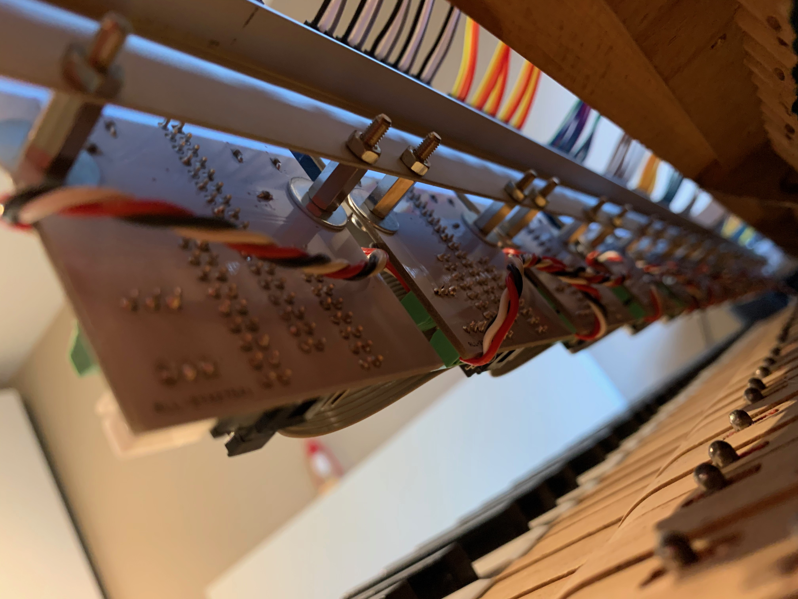
